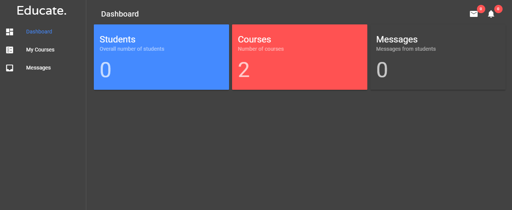
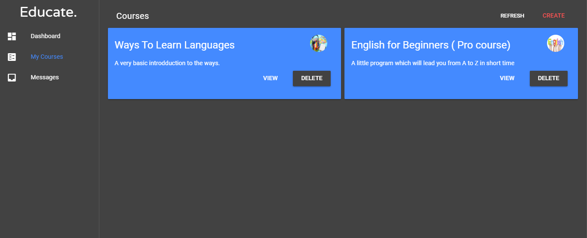

# Educate.

> Dashboard for Educationla Portal 

## Dashboard Page



## Courses Page



``` bash
# install dependencies
npm install

# serve with hot reload at localhost:8080
npm run dev

# build for production with minification
npm run build
```
